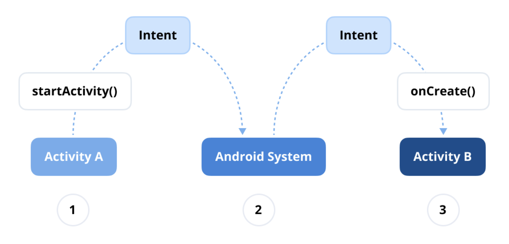

# Category 0: The Android Framework

## Q) 1. What is Intent?

`Intent`는 수행할 작업에 대한 추상적인 설명을 담고 있는 **메시지 객체**로, `Activity`, `Service`, `BroadcastReceiver` 간의 **통신**을 가능하게 해준다. 
이 외에도 컴포넌트 간 **데이터를 전달하는 용도**로도 활용되어 **Android**의 컴포넌트 기반 아키텍처에서 핵심적인 역할을 합니다.

Q ) 그렇다면 `Intent`는 `IPC`일까?

// 나중에 블로그 링크 첨부

**Android**에서 `Intent`는 두 가지 유형: **명시적**, **암시적** `Intent`로 나뉜다.

### 1. 명시적(Explicit) Intent

- **정의:** **명시적 Intent**는 호출할 **컴포넌트**(**Activity** 또는 **Service**)를 직접 이름으로 지정하여 명시적으로 지정하는 Intent이다.

- **사용 사례:** 앱 내에서 특정 액티비티를 시작할 때와 같이 **대상 컴포넌트**를 알고 있을 때 사용한다.

- **예시 시나리오:** 동일한 앱 내에서 **하나의 액티비티**에서 **다른 액티비티**로 화면을 전환할 때는 사용한다.

```kotlin
val intent = Intent(this, TargetActivity::class.java)
startActivity(intent)
```

### 2. 암시적(Implicit) Intent

- **정의:** **암시적 Intent**는 특정 컴포넌트를 명시하지 않고, 수행할 **일반적인 동작**만 선언한다. 
시스템은 `action`, `category`, `data` 정보를 기반으로 해당 Intent를 처리할 수 있는 컴포넌트를 자동으로 선택한다.

- **사용 사례:** **시스템**이나 **다른 앱**이 처리할 수 있는 작업을 요청할 때 사용한다. (예: 웹페이지 열기, 콘텐츠 공유 등)

- **예시 시나리오:** 브라우저에서 **웹페이지를 열거나**, 다른 앱과 **콘텐츠(이미지)를 공유**하는 경우 암시적 Intent를 사용한다. 이때, 어떤 앱이 실행될지는 시스템이 판단한다.

```kotlin
val intent = Intent(Intent.ACTION_VIEW)
intent.data = Uri.parse("https://www.example.com")
startActivity(intent)
```

### 실전 질문

**Q)**
**명시적 Intent**와 **암시적 Intent**의 주요 차이점은 무엇이며, 각각 어떤 상황에서 사용하나요?

**Q**
**Android 시스템**은 **암시적 Intent**를 어떤 방식으로 처리하며, 처리 가능한 앱이 없을 경우 어떻게 되나요?

**A)**
**Android 시스템**은 `Intent Filter`를 기준으로 해당 Intent를 처리할 수 있는 앱 또는 컴포넌트를 탐색한다. `Action`, `category`, `data` 정보를 기반으로 기준에 일치하는 `Intent Filter`를 가진 앱들을 찾는다.  
이 때, 처리 가능한 앱이 없다면 `ActivityNotFoundException` 예외가 발생하며 앱이 크래시할 수 있기에 `resolveActivity()` 또는 `packageManager.queryIntentActivities()` 같은 `API`로 사전 체크하는 것이 권장된다.

### 💡Pro Tips for Mastery: What is Intent Filters?
**Android**의 `Intent Filter`는 앱 컴포넌트가 **링크 열기**나 **브로드캐스트(broadcast) 처리**와 같은 특정 Intent에 어떻게 반응할 지를 정의한다.  
이는 `activity`, `service`, 또는 `broadcast receiver`가 처리할 수 있는 Intent의 유형을 선언하는 **필터 역할**을 하며, `AndroidManifest.xml` 파일에 명시된다.  
각 `Intent Filter`는 수신된 Intent를 정확하게 판별하기 위해 `action`, `category`, 그리고 `data` 타입을 포함할 수 있다. `Intent Filter`를 올바르게 정의하면 앱이 다른 앱 및 시스템 구성 요소와 원활하게 상호작용하도록 하여 성능을 향상시킬 수 있다.


> **암시적 Intent**가 전송될 때, **안드로이드 시스템**은 설치된 앱들의 `AndroidManifest.xml` 파일에 정의된 `Intent Filter`와 해당 **Intent의 속성**을 비교하여 어떤 컴포넌트를 실행할지 결정한다.  
**일치하는 컴포넌트**가 발견되면, 시스템은 해당 컴포넌트를 시작하고 Intent 객체를 전달한다. 만약 **여러 컴포넌트**가 일치하는 경우, 시스템은 사용자에게 **선택 다이얼로그**를 표시하여 해당 동작을 처리할 앱을 선택하도록 한다.


