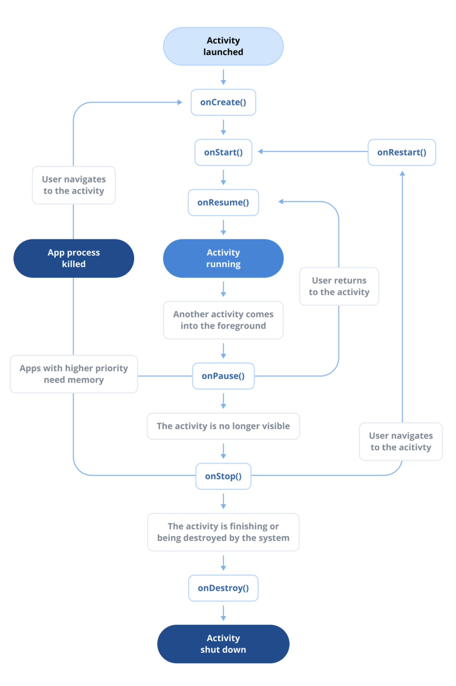

# Category 0: The Android Framework

## Q) 7. Describe the Activity lifecycle

**Android**의 **액티비티 생명주기**는 하나의 액티비티가 생성되어 종료될 때까지 거치는 다양한 상태들을 설명한다.  
이러한 상태들을 이해하는 것은 리소스를 효율적으로 관리하고, 사용자 입력을 처리하며, 부드러운 사용자 경험을 제공하는 데 필수적이다.

**액티비티 생명주기**의 주요 단계:

1. **onCreate():**  
액티비티가 생성될 때 가장 먼저 호출되는 메서드이다. 해당 메서드에서 액티비티를 **초기화**하고, **UI 컴포넌트를 설정**하며, 저장된 인스턴스 상태가 있다면 **복원 작업**을 수행한다.  
`onCreate()`는 액티비티 생명주기 동안 한 번만 호출되며, 액티비티가 제거되었다가 다시 생성될 때에만 다시 호출된다.
2. **onStart():**  
액티비티가 사용자에게 화면에 보이게 되는 시점이지만, 아직 사용자와의 **상호작용**은 불가능한 상태다.  
`onCreate()` 이후, `onResume()` 이전에 호출된다.
3. **onRestart():**  
액티비티가 중지된 상태에서 다시 시작될 때 호출되며 해당 메서드는 `onStart()` 바로 전에 호출된다.
4. **onResume():**  
액티비티가 화면 `foreground`에 표시되며 사용자와 상호작용이 가능한 상태가 된다.  
일시 중지된 **UI 업데이트**, **애니메이션**, **입력 리스너** 등을 재개하는 작업은 이 메서드에서 수행한다.
5. **onPause():**  
액티비티가 다른 액티비티에 의해 일부가 가려졌을 때(예: 다이얼로그) 호출된다.  
화면은 여전히 보이지만 **포커스**를 잃은 상태이며, **애니메이션**, **센서 업데이트**, **데이터 저장**과 같은 작업을 일시 중지하는데 사용된다.
6. **onStop():**  
액티비티가 사용자에게 더 이상 보이지 않게 될 때 호출된다.
이 때 필요 없는 **백그라운드 작업**이나 **무거운 객체**와 같은 리소스를 해제해야 한다.
7. **onDestroy():**  
액티비티가 완전히 종료되어 메모리에서 **제거되기 직전**에 호출된다.
남아 있는 모든 리소스를 해제하는 **마지막 정리 작업**을 수행하는 메서드다.

### 실전 질문

**Q)** `onPause()`와 `onStop()`의 차이점은 무엇이며, **리소스 소모가 많은 작업**을 처리할 때 각각 어떤 시나리오에서 사용해야 하나요?

**A)** `onPause()`는 액티비티가 부분적으로 가려져 **포커스를 잃었을 때** 호출되고, `onStop()`은 액티비티가 **완전히 보이지 않게 되었을 때** 호출됩니다.
이 '가시성'의 차이가 언제 어떤 작업을 처리해야 하는지를 결정합니다.
그렇기 때문에 리소스 소모가 많은 작업을 처리할 때 `onPause()`보다는 화면을 온전히 벗어난 시점인 `onStop()`에서 처리하는 것이 더 적합합니다.
