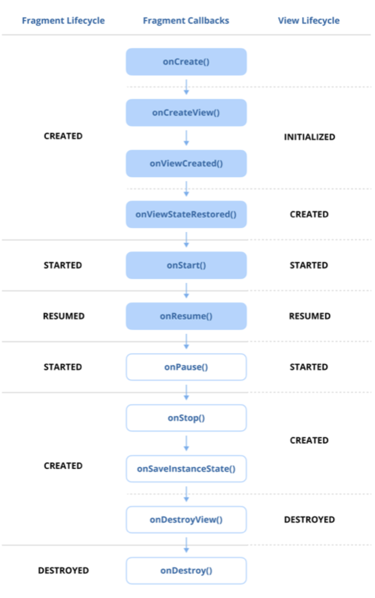

# Category 0: The Android Framework

## Q) 8. Describe the Fragment lifecycle

각 프래그먼트 인스턴스는 자신이 연결되어 있는 액티비티의 생명주기와는 별도의 생명주기를 가진다.
사용자가 앱과 상호작용하는 동안, 프래그먼트는 추가되거나 제거되거나 화면에 나타나고 사라지는 등의 상황에 따라 서로 다른 생명주기 상태로 전환된다.
이러한 단계에는 **생성**, **시작**, **화면에 표시**, **활성화**가 포함되며, 더 이상 필요하지 않을 때는 **정지되거나 파괴되는 상태**로 전환된다.
이러한 전환 과정을 올바르게 관리하면 프래그먼트가 리소스를 효율적으로 다루고, UI 일관성을 유지하며, 사용자 동작에 매끄럽게 반응할 수 있다.

안드로이드에서의 프래그먼트 생명주기는 액티비티 생명주기와 유사하지만, 프래그먼트 고유의 추가 메서드와 동작이 포함되어 있다.

1. **onAttach():**  
프래그먼트가 부모 액티비티와 연결될 때 처음 호출되는 콜백으로 해당 시점에서 프래그먼트는 액티비티에 부착되며 액티비티의 Context와 상호작용할 수 있다.

2. **onCreate():**  
프래그먼트를 초기화하기 위해 호출되며, 이 시점에서 프래그먼트 자체는 생성되었지만 UI는 아직 만들어지지 않았다.
주로 필수 컴포넌트 초기화나 저장된 상태 복원 작업을 수행한다.

3. **onCreateView():**  
프래그먼트의 UI가 처음으로 그려질 때 호출된다.
여기에서 프래그먼트 레이아웃을 **LayoutInflater**를 사용해 인플레이트한 뒤 루트 뷰를 반환한다.

4. **onViewStateRestored():**  
프래그먼트의 뷰 계층 구조가 생성된 뒤, 저장된 상태가 뷰에 복원된 후 호출된다.

5. **onViewCreated():** 
프래그먼트의 뷰가 생성된 직후 호출된다. UI 컴포넌트를 초기화하고 사용자 입력 처리 로직 등을 설정하는 데 사용된다.

6. **onStart():**  
프래그먼트가 사용자에게 표시되기 시작하는 시점이다.
액티비티의 onStart()와 동일한 역할을 하며, 아직 완전히 포그라운드에 있지는 않다.

7. **onResume():**  
프래그먼트가 완전히 활성화되고 포그라운드에서 실행되는 상태다.
이때부터 사용자가 프래그먼트와 상호작용할 수 있다.

8. **onPause():**  
프래그먼트가 포그라운드에는 없지만 여전히 보이는 상태로 곧 포커스를 잃게 된다.
그렇기에 포그라운드에서만 유지되어야 하는 작업들을 일시 중지해야 합니다.

9. **onStop():**  
프래그먼트가 사용자에게 더 이상 보이지 않을 때 호출된다. 이 시점에서는 화면 밖에서도 불필요한 작업들을 중단해야 한다.

10. **onSaveInstanceState():**  
프래그먼트가 파괴되기 전에 UI와 관련된 상태 데이터를 저장할 때 호출된다.

11. **onDestroyView():**  
프래그먼트의 뷰 계층 구조가 제거될 때 호출된다. 어댑터 해제, 참조 null 처리 등 뷰와 관련된 리소스를 정리하여 메모리 누수를 방지해야 한다.

12. **onDestroy():**  
프래그먼트 자체가 파괴될 때 호출된다. 이 시점에서 모든 리소스를 정리해야 하지만, 프래그먼트는 여전히 부모 액티비티에 연결된 상태이다.

13. **onDetach():**  
프래그먼트가 부모 액티비티로부터 분리되어 더 이상 연결되지 않았을 때 호출된다.
이는 마지막 콜백으로, 프래그먼트의 생명주기가 완전히 종료된다.

### 실전 질문
**Q)** `onCreateView()`와 `onDestroyView()`의 목적은 무엇이며, 왜 이 메서드들에서 뷰 관련 리소스를 올바르게 처리하는 것이 중요한가요?

**A)** `onCreateView()`에서 UI가 처음으로 그려지며(LayoutInflater), `onDestroyView()`에서 뷰와 관련된 리소스를 정리합니다.
뷰 계층이 실제 만들어지고 파괴되는 시점이 이 두 메서드가 호출되는 시점이기에 뷰와 관련된 리소스를 해당 메서드들에서 처리해야 합니다.
