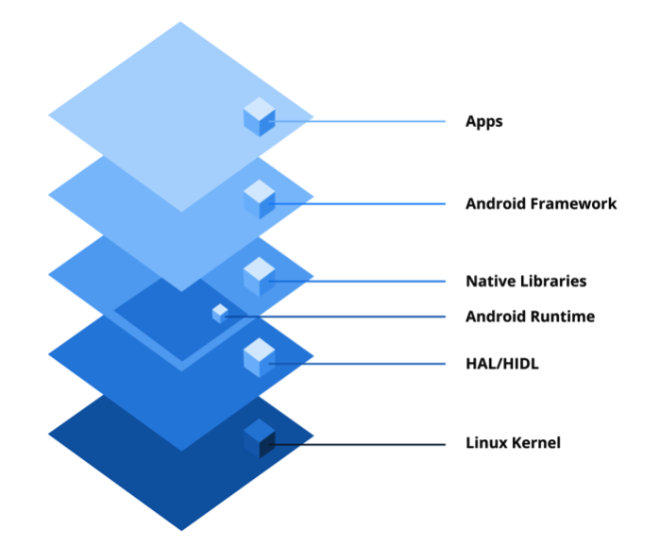

# Category 0: The Android Framework

## Q) 0. What is Android?

**Android**는 **Google**에서 개발 및 유지되며, `Linux kernel` 기반의 `오픈 소스(open source)` **운영체제**이다.

### Key Features

1. **오픈 소스와 커스터마이징:**
   
   **Android**는 오픈 소스로 자유롭게 수정이 가능하다. 이러한 유연성 덕에 **Android**는 다양한 디바이스에 폭넓게 채택되어 왔다.

2. **SDK를 활용한 애플리케이션 개발:**

   **Android** 애플리케이션은 `Java`나 `Kotlin`으로 개발되며, **Android** `Software Development Kit(SDK)`를 활용한다.

3. **풍부한 앱 생태계** :

   **Google Play Store**는 **Android**의 공식 앱 배포 플랫폼으로, 다양한 카테고리의 앱을 제공한다. 이 외에도 써드파티 스토어나 직접 다운로드 방식으로도 앱을 배포할 수 있다.

4. **멀티태스킹 및 리소스 관리:**

   **Android**는 멀티태스킹을 지원하며, 관리형 메모리 시스템과 가비지 컬렉션(GC)으로 다양한 기기에서 최적의 성능을 유지한다.

5. **다양한 하드웨어 지원:**

   다양한 화면 크기, 해상도, 하드웨어 구성과의 높은 호환성을 제공한다.

### Android Architecture

- **리눅스 커널:**

   **Android**의 기반을 이루는 `Linux kernel`은 하드웨어 추상화를 담당하여 소프트웨어와 하드웨어 간의 원활한 상호작용을 돕는다.
   주요 역할에는 `메모리 및 프로세스 관리`, `보안 유지`, 그리고 Wi-Fi, Bluetooth, 디스플레이와 같은 하드웨어 구성 요소를 위한 `디바이스 드라이버 관리`가 포함된다.

- **하드웨어 추상화 계층(HAL):**
  
   `Hardware Abstraction Layer(HAL)`은 **Android**의 `Java API framework`와 디바이스 하드웨어를 연결해주는 **표준 인터페이스**를 제공한다.
   **프레임워크 API**가 접근을 요청하면 **Android** 시스템은 해당 요청을 처리하기 위해 특정 하드웨어에 맞게 설계된 라이브러리 모듈들로 구성된 `HAL 모듈`을 동적으로 로드한다.

   - `HAL Interface Definition Language(HIDL)`는 `HAL`과 사용자 간의 인터페이스를 지정하는 인터페이스 설명 언어로, `프로세스 간 통신(IPC)`에 사용하기 위한 언어이다. 
   - **Android 10**부터 `HIDL`은 지원이 중단되었으며, 현재는 `Android Interface Definition Language(AIDL)`로 대체되었다.

- **Android 런타임(ART)과 코어 라이브러리:**

   `Android Runtime(ART)`는 `Java` 또는 `Kotlin`으로 작성된 코드를 **바이트코드**로 컴파일하여 실행한다.
   `ART`는 성능 최적화를 위해 `Ahead-of-Time(AOT)`와 `Just-in-Time(JIT)` 컴파일을 지원한다.
   코어 라이브러리는 자료구조, 파일 처리, 스레딩 등 **필수 API**를 제공하여 앱 개발에 필요한 기본 환경을 구성한다.

- **네이티브 C/C++ 라이브러리:**
  
   **Android**에는 **핵심 기능** 지원을 위해 `C` 및 `C++`로 작성된 **네이티브 라이브러리**들이 포함된다.
   예를 들어, `OpenGL`은 **그래픽 렌더링**을, `SQLite`는 **데이터베이스 작업**을, `WebKit`은 **웹 콘텐츠 표시**를 담당한다.
   이러한 라이브러리들은 **Android** 프레임워크 내부에서도 활용되며, 성능이 중요한 작업에서는 애플리케이션에서 직접 사용되기도 한다.

- **Android 프레임워크(API):**
  
   **애플리케이션 프레임워크 계층**은 앱 개발을 위한 **고수준의 서비스와 API**를 제공한다.
   해당 계층에는 `ActivityManager`, `NotificationManager`, `Content Providers` 등, 개발자가 **Android** 시스템 기능을 효율적으로 활용하여 앱을 구축할수 있도록 돕는 구성 요소들이 포함된다.

- **애플리케이션:**
  
  최상위 계층은 사용자에게 **직접 노출**되는 앱들로 구성된다.
  연락처, 설정과 같은 `시스템 앱`, 그리고 **Android SDK**를 사용해 제작된 `서드파티 앱`들이 여기에 포함된다.
  해당 앱들은 **하위 계층에 의존**하여 기능을 제공한다.

### 실전 질문

**Q)** **Android**의 플랫폼 아키텍처는 `Linux kernel`, `Android Runtime(ART)`, `하드웨어 추상화 계층(HAL)` 등 여러 계층으로 구성되어 있습니다.
해당 구성 요소들이 어떻게 함께 작동하여 **애플리케이션 실행**과 **하드웨어 상호작용**을 보장하는지 설명하시오.

**A)** 

**Android**는 `Linux kernel` 위에서 동작하며, `HAL`은 **프레임워크**와 **하드웨어** 간의 중간 다리 역할을 하여 하드웨어 접근을 가능하게 한다.
 
`ART`는 `Java` 기반 애플리케이션을 실행하는 런타임 환경으로, `가비지 컬렉션`, `메모리 관리` 등을 통해 효율적인 실행을 보장한다.
 
또한, **네이티브 C/C++ 라이브러리**는 `그래픽 처리`, `데이터베이스`, `웹 렌더링` 등 고성능 작업을 지원하며, 시스템 전반에 걸쳐 사용된다.
 
**Android** 프레임워크는 애플리케이션 개발을 위한 다양한 `API`를 제공하며, 이를 통해 시스템 기능에 접근하고 앱을 구성할 수 있다.
 
최상위 계층에 위치한 애플리케이션은 이러한 모든 구성 요소를 활용하여 사용자 인터페이스를 구성하고, 시스템 리소스를 활용하며, 다양한 기능을 수행한다.
---
