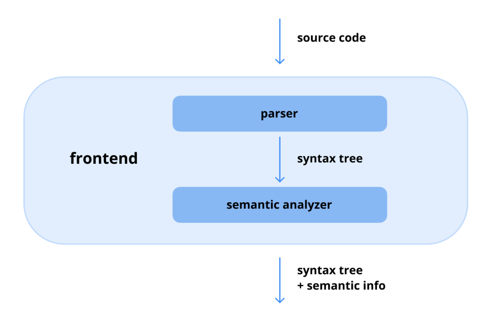
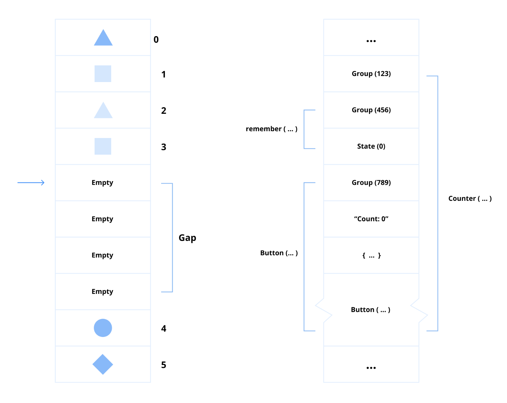
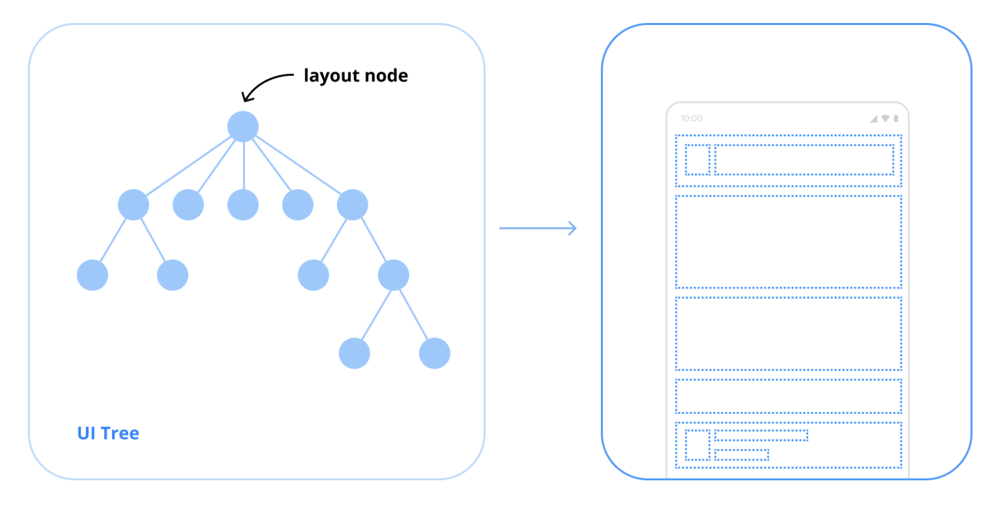

# Category 0: Compose Fundamentals

**Jetpack Compose**는 세 가지 주요 구성 요소인 **Compose Compiler**, **Compose Runtime**, **Compose UI**로 이루어져 있다.
`remember`, `LaunchedEffect`, `Box`, `Column`, `Row`와 같이 UI 화면을 만드는데 사용되는 대부분의 `API`는 **Runtime**과 **UI** 레이어에서 제공된다.
내부적으로 **Jetpack Compose**는 더 복잡하게 구성되어 있으며, 라이브러리 종속성을 추가하는 것만으로 프로젝트에 매끄럽게 통합할 수 있다.

애플리케이션을 빌드하는 데 **Compose** 내부 구조에 대한 깊은 이해가 필수는 아니지만, 전반적인 아키텍처를 파악하고 있으면 **Compose**의 다양한 역할을 이해하는 데 큰 도움이 될 수 있다.
특히 **Compose**의 **렌더링 단계**나 **선언형 UI 개발**의 본질과 같은 개념을 이해하는 데 유용하다.

## Q) 0. What is the structure of Jetpack Compose?

**Jetpack Compose**는 **선언형** 접근 방식을 사용하여 네이티브 안드로이드 애플리케이션을 빌드하는 최신 **UI 툴킷**이다.
**Compose Compiler**, **Compose Runtime**, **Compose UI**라는 세 가지 핵심 요소로 구성되며,
각 구성 요소는 UI 코드를 상호작용이 가능한 애플리케이션으로 변환하는 데 중요한 역할을 한다.

### Compose Compiler
**Compose Compiler**는 `Kotlin`으로 작성된 선언적 UI 코드를 **Jetpack Compose**가 실행할 수 있는 최적화된 코드로 변환하는 역할을 한다. 
`@Composable` 함수를 컴파일 중에 처리하고 필요한 **UI 업데이트** 및 **리컴포지션(Recomposition)** 로직을 생성한다.
이 외에도 `Kotlin` 컴파일러와 통합되어 효율적인 코드 생성을 보장하며, 더 나은 성능을 위해 **상태 관리**, **코드 최적화**, **람다 리프팅**과 같은 기능을 지원한다.

기존의 `KAPT`나 `KSP` 같은 어노테이션 처리 도구들과 달리, **Compose Compiler** 플러그인은 `Frontend Intermediate Representation(FIR)`에서 직접 동작한다.  
- **IR:** 컴파일러가 컴파일 과정 중 소스 코드를 표현하기 위해 사용하는 추상적인 코드 구조이다. 이는 **소스 코드**와 **타겟 머신 코드** 사이의 다리 역할을 하며, 플랫폼에 **독립적인 최적화**, **코드 분석**, **효율적인 코드 생성**을 가능하게 한다.

이는 컴파일러가 컴파일 중에 더 깊은 정적 코드 분석에 접근하거나, `Kotlin` 소스 코드를 동적으로 변환하여 최적화된 `Java` **바이트코드**를 생성할 수 있게 해준다.

`@Composable`과 같은 **Compose** 라이브러리의 어노테이션들은 **Compose Compiler**의 내부 메커니즘과 매끄럽게 연동되어 
**코드 생성**, **리컴포지션 관리**, **성능 최적화** 같은 작업을 조율한다. 이런 독특한 접근 방식은 `Kotlin` 컴파일러 파이프라인과 통합되어 **개발 효율성**과 **런타임 성능**을 모두 향상시킨다.

해당 그림은 `FIR`이 생성되는 과정을 보여주는 도식으로, 크게 두 가지 단계를 거친다.
1. **Parser:**  
`Parser`는 소스 코드를 입력받아 `구문 트리(Syntax Tree)`를 생성한다. 구문 트리는 **문법적 구조**를 계층적으로 나타낸 것으로, **함수 호출**, **변수 선언**, **조건문** 등이 어떤 구조로 이루어져 있는지 나타낸다. 
해당 단계에서는 아직 코드의 `의미(semantic)`는 파악하지 못한다.

2. **Semantic Analyzer:**  
`Semantic Analyzer`는 `Parser`가 생성한 **구문 트리**를 입력받아 코드의 의미를 파악한다. 변수의 타입이 올바른지, 함수가 올바른 매개변수로 호출되었는지 등을 확인한다.
해당 과정에서 **구문 트리**에 **타입 정보**나 **참조 정보** 같은 **의미론적(semantic)** 정보가 추가된다.

### Compose Runtime

**Compose Runtime**은 리컴포지션과 상태 관리를 지원하는 데 필요한 핵심 기능을 제공한다. 이는 `변경 가능한 상태(mutable states)`를 처리하고, `스냅샷(snapshots)`을 관리하며,
애플리케이션의 상태가 변경될 때마다 **UI 업데이트**를 트리거한다. 해당 컴포넌트는 **Compose**의 반응형 UI 시스템을 구동하는 **엔진 역할**을 하며,
**상태 변경**에 따라 올바른 UI 요소가 동적으로 업데이트되도록 보장한다.

**Compose Runtime**은 `슬롯 테이블(slot table)`을 사용하여 컴포지션의 상태를 `메모이제이션(memoizing)`하며 동작하는데,
이는 `갭 버퍼(gap buffer)` 데이터 구조에서 영감을 받았다. 내부적으로는 반응형 UI를 구축하는 데 필수적인 여러 중요한 작업을 수행한다.  
여기에는 `사이드 이펙트(side effects)` 관리, `remember`를 사용한 **상태 보존**, 상태 변경 시 **리컴포지션** 트리거, `CompositionLocal`을 사용한 컨텍스트별 데이터 저장, 
그리고 UI 계층을 효율적으로 생성하기 위한 **Compose 레이아웃 노드** 구성이 포함된다.

- **슬롯 테이블:** **Composition** 단계에서 UI 요소들의 상태를 저장하고 관리하는 데 사용되는 데이터 구조로 **UI 컴포넌트**, 그 **관계**, 그리고 관련된 **상태**들을 효율적으로 추적하며, 상태 변화에 영향을 받는 요소들만 업데이트하여 최적화된 리컴포지션을 가능하게 한다.
- **갭 버퍼:** 텍스트 편집기에서 동적인 문자 시퀀스를 효율적으로 관리하기 위해 흔히 사용되는 데이터 구조로 `갭(gap)`을 가진 연속된 메모리 블록을 유지하여 필요한 경우에만 요소를 이동시킴으로써 빈번한 수정에 따르는 오버헤드를 줄이고 삽입 및 삭제를 빠르게 할 수 있게 한다.
- **사이드 이펙트:** 프로그래밍에서 값을 반환하는 것을 넘어, 프로그램의 **상태에 영향**을 주거나 **외부 환경과 상호작용**하는 모든 행위를 일컫는다. **변수 수정**, **네트워크 요청**, **UI 업데이트** 등이 예시이며 이들은 함수 범위를 벗어나 프로그램 동작에 영향을 줄 수 있다.

### 💡Pro Tips for Mastery: Migrating from a gap buffer to a link table

**Android** 팀은 `갭 버퍼`에서 `링크 테이블(Link Table)`이라는 데이터 구조로 전환하고 있다. **링크 테이블**은 연결된 노드들을 이용해 데이터를 구성하며, 요소의 `삽입`, `삭제`, `재배열`을 효율적으로 처리할 수 있다.  
이러한 변화는 **슬롯 테이블**을 편집할 때의 성능을 향상시키면서, 구축할 때의 기존 효율성은 그대로 유지하기 위함이다.

### Compose UI

**Compose UI** 레이어는 애플리케이션을 구축하기 위한 **고수준 컴포넌트**와 **UI 위젯**을 제공한다. 이는 `텍스트`, `버튼`, `레이아웃 컨테이너` 같은 기본적인 요소뿐만 아니라,
`커스텀 UI 컴포넌트`를 만들기 위한 고급 `API`도 포함한다. **Compose UI** 모듈은 **Android**의 UI 시스템과 통합되어, **Compose** 기반의 UI가 안드로이드 기기에서 매끄럽게 렌더링되도록 한다.

**Compose UI** 라이브러리는 **Compose 레이아웃 트리**를 구축하는 과정을 간소화하기 위해 설계된 다양한 컴포넌트들을 제공하며, 이렇게 만들어진 트리는 **Compose Runtime**에 의해 처리된다.  
**JetBrains**는 `Kotlin Multiplatform`를 기반으로 `Compose Multiplatform`의 stable version을 출시했으며, 이를 통해 개발자들은 여러 플랫폼에서 동일한 **Compose UI** 라이브러리를 사용하여 일관된 UI를 만들 수 있게 되었다.

### 실전 질문

**Q)** **Compose Compiler**의 역할은 무엇이며, `KAPT`나 `KSP` 같은 기존의 어노테이션 처리기와는 어떻게 다른가요?

**Q)** **Compose Runtime**은 리컴포지션과 상태를 어떻게 관리하며, 내부적으로 어떤 데이터 구조를 사용하나요?