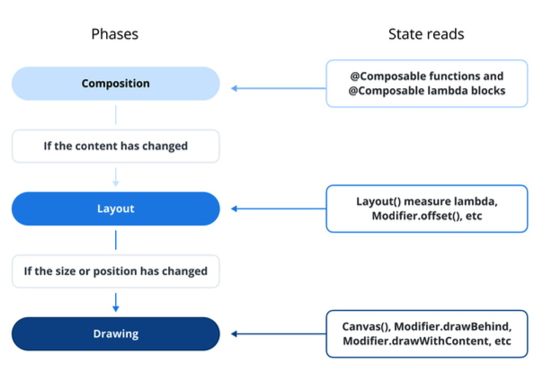
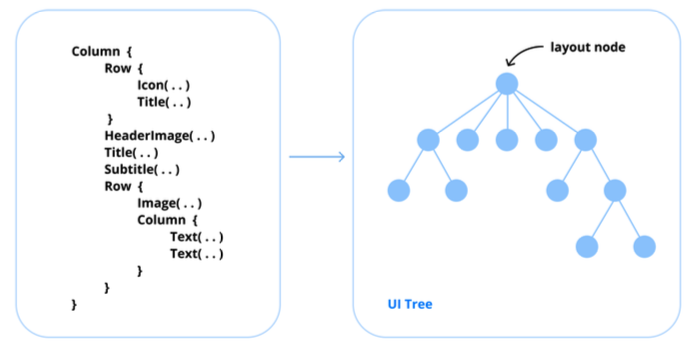
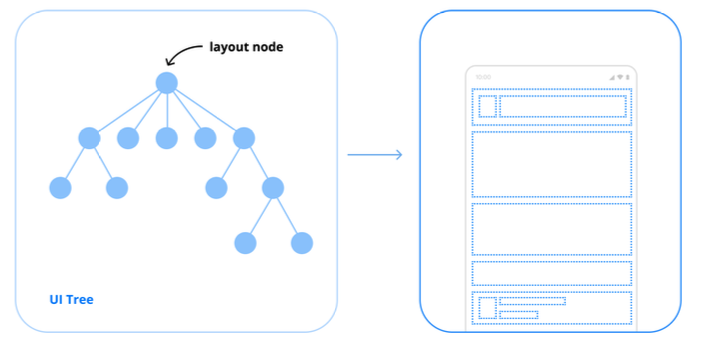
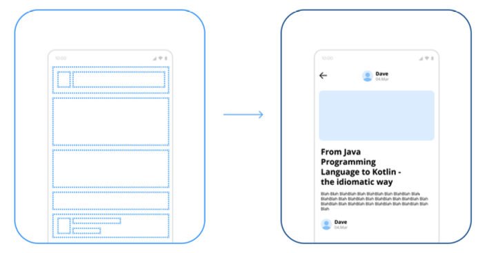

# Category 0: Compose Fundamentals

## Q) 0. What are the Compose phases?
**Jetpack Compose**는 명확하게 정의된 렌더링 파이프라인을 따르며, 이 과정은 **Composition**, **Layout**, **Drawing**이라는 세 가지 핵심 단계로 나뉜다.
이 단계들은 **순차적**으로 실행되면서 UI를 구성하고, 배치하고, 화면에 효율적으로 렌더링한다.

### Composition

**Composition** 단계는 `@Composable` 함수를 실행해 컴포저블 함수들의 설명을 생성하고, **UI 트리**를 구축하는 역할을 한다.
이 단계에서 **Compose**는 초기 UI 구조를 만들고, 컴포저블 간의 관계를 `Slot Table`이라는 데이터 구조에 기록한다. 
`상태 변화(state change)`가 발생하면 **Composition** 단계는 영향받은 UI 부분만 다시 계산하고, 필요한 경우 `재구성(recomposition)`을 트리거한다.

### Composition 단계의 주요 작업

- `@Composable` 함수 실행
- UI 트리 생성 및 갱신
- 재구성(Recomposition)을 위한 변경 추적

### Layout
**Layout** 단계는 **Composition** 단계 이후에 진행된다.
이 단계에서는 제공된 `제약조건(constraints)`을 바탕으로 각 UI 요소의 크기와 위치를 결정한다.
각 Composable은 자신의 자식 요소들을 측정하고, 그 결과를 바탕으로 자신의 최종 크기를 확정한다.

### Layout 단계의 주요 작업

- UI 컴포넌트 측정
- 너비, 높이, 위치 정의
- 자식 배치(Arrangement)

### Drawing
**Drawing** 단계는 **Composition**과 **Layout**을 마친 UI 요소들을 실제 화면에 `렌더링(rendering)`하는 과정이다.
이 단계에서 **Compose**는 `Skia 그래픽 엔진`을 사용하여 하드웨어 가속을 기반으로 빠르고 부드럽게 화면에 UI를 그린다.
필요하다면 `Canvas API`를 활용해 **사용자 정의 Drawing 로직**을 구현할 수 있다.

### Drawing 단계의 주요 작업

- 시각적 요소 렌더링(Rendering)
- UI 컴포넌트 화면에 그리기
- 커스텀 Drawing 연산 적용

### 실전 질문

**Q)** **Composition** 단계에서 어떤 일이 일어나며, 이것이 **Recomposition**과 어떻게 연결되나요?

**A)** **Composition** 단계에서는 `@Composable` 함수들을 실행하여 **UI 트리**를 만들고, 컴포저블 간의 관계를 `Slot Table`이라는 데이터 구조에 기록합니다.
`상태(state)`가 변경되면, **Compose**는 영향받은 부분만 다시 실행하여 UI를 업데이트하는데, 이 과정을 `Recomposition(재구성)` 이라고 부릅니다.

**Q)** **Layout** 단계는 어떻게 동작하나요?

**A)** **Layout** 단계는 **Composition**에서 만들어진 **UI 트리**를 실제 화면에 배치할 수 있도록 크기와 위치를 계산하는 단계로,
각 **Composable**은 자식들을 측정해서, 부모로부터 받은 제약 조건 안에서 자신의 너비, 높이를 결정합니다.
그다음, 부모-자식 관계에 따라 자식의 위치를 정해 최종적으로 화면 배치가 완료됩니다.
