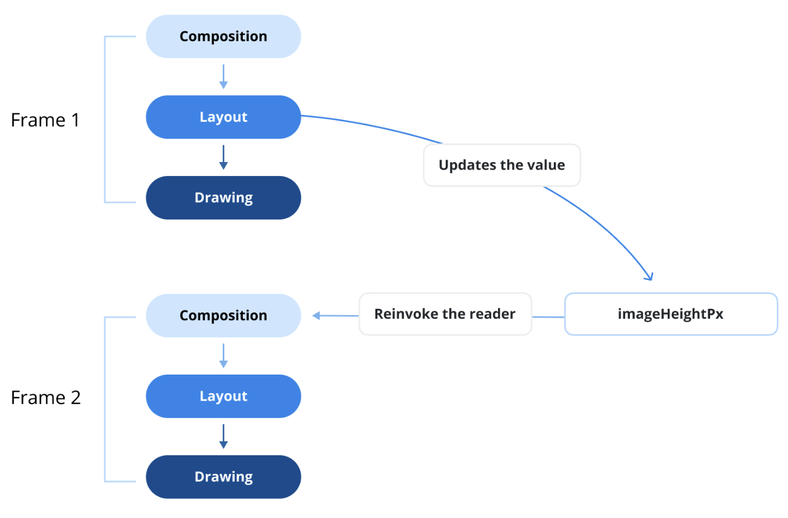

# Category 0: Compose Fundamentals

## Q) 3. What is recomposition, and when does it occur? Also, how does it related to the app performance?

**Jetpack Compose**의 세 가지 주요 단계(Composition, Layout, Drawing)를 거쳐 이미 렌더링된 UI 레이아웃을 갱신하기 위해,
프레임워크는 상태 변화가 발생했을 때 UI를 다시 그리는 메커니즘을 제공한다. 이 과정을 `Recomposition(재구성)` 이라고 한다.

**Recomposition**이 발생하면 Compose는 **Composition** 단계부터 다시 시작하며, 컴포저블 노드들이 UI 변경 사항을 프레임워크에 알리게 된다.
이를 통해 업데이트된 UI가 최신 상태를 반영하도록 보장한다.

### Recomposition 유발하는 조건

대부분의 모바일 애플리케이션은 `상태(state)`를 유지하는데, 이 상태는 앱의 데이터 모델을 메모리에 표현한 것이라 할 수 있다.
**Jetpack Compose**는 UI가 상태 변화와 동기화되도록 하기 위해 두 가지 주요 메커니즘을 통해 재구성을 실행한다:

1. **입력 값의 변경:**  
`@Composable` 함수는 입력 매개변수가 변경되면 재구성을 트리거한다.
이 떄 **Compose 런타임**은 새로운 인자와 이전 인자를 `equals()` 함수로 비교하며,
비교 결과가 `false`면 런타임은 변화가 있다고 감지하고, 해당 UI 부분을 다시 계산하여 재구성을 수행한다. 
2. **상태 변화 관찰:**  
**Jetpack Compose**는 `State API`를 사용해 상태 변화를 관찰하는데, 보통은 `remember` 함수와 함께 사용된다.
이 방식은 상태 객체를 메모리에 보존하고, 재구성 시 이를 복원하여 UI가 항상 최신 상태를 반영하도록 만든다.
이 과정은 수동으로 UI를 업데이트하지 않아도 되도록 보장한다.

### Recomposition과 그 성능

**Jetpack Compose**에서 재구성은 반응형 UI 특성의 핵심이지만, 과도하거나 불필요한 재구성은 앱 성능을 저하시킬 수 있다.
따라서 재구성이 어떻게 작동하는지 이해하고, 이를 효과적으로 추적하는 것이 Compose 애플리케이션 최적화에 매우 중요하다.
재구성은 여러 요인의 영향을 받는다. 예를 들어, `Stability(안정성)` 개념이 큰 영향을 주며, 이는 뒷부분 “What is stability?” 질문에서 더 자세히 다뤄진다.
성능을 높이려면, 불필요한 재구성을 찾아내고 줄여야 한다. 이를 위해 Compose는 `Layout Inspector`라는 도구를 제공한다.

`Layout Inspector`는 실행 중인 앱의 Compose 레이아웃을 에뮬레이터나 실제 기기에서 검사할 수 있게 해준다.
이를 통해 어떤 Composable이 얼마나 자주 재구성되거나 건너뛰어졌는지를 모니터링할 수 있으며, 잠재적인 성능 문제를 식별하는 데 도움을 준다.
예를 들어, 코딩 실수로 인해 UI가 과도하게 재구성되어 성능이 저하될 수 있고, 반대로 재구성이 발생하지 않아 UI가 갱신되지 않고 시각적 업데이트가 막힐 수도 있다.

**Android Studio**에서 `Layout Inspector`는 재구성이 발생할 때마다 이를 하이라이트하여, 어떤 UI 부분이 재구성을 유발하는지 쉽게 파악할 수 있도록 도와준다.
이 도구는 재구성 횟수를 추적하고 이를 활용하여 UI 업데이트를 최적화함으로써 Compose 앱의 성능을 최적 상태로 유지하는 데 유용하다.

또 다른 도구로는 `Composition Tracing`이 있으며, 프로젝트 내에서 재구성 추적을 시도해볼 수 있다.
이 도구는 성능 문제를 진단하는 데 유용하며, 낮은 오버헤드로 측정할 수 있는 `시스템 트레이싱(system tracing)`과, 함수 호출을 상세하게 추적할 수 있는 `메서드 트레이싱(method tracing)`을 제공한다.
일반적으로 시스템 트레이스에는 개별 `Composable` 함수가 포함되지 않지만, 현재 진행 중인 개선 작업은 시스템 트레이싱의 효율성과 메서드 트레이싱의 세밀함을 결합하여 Compose 동작에 대한 가시성을 향상시키는 것을 목표로 하고 있다.

### 실전 질문
**Q)** 불필요한 재구성을 줄이고 앱 성능을 최적화한 경험이 있나요? 이 문제를 완화하기 위해 어떤 전략을 사용할 수 있을까요?
